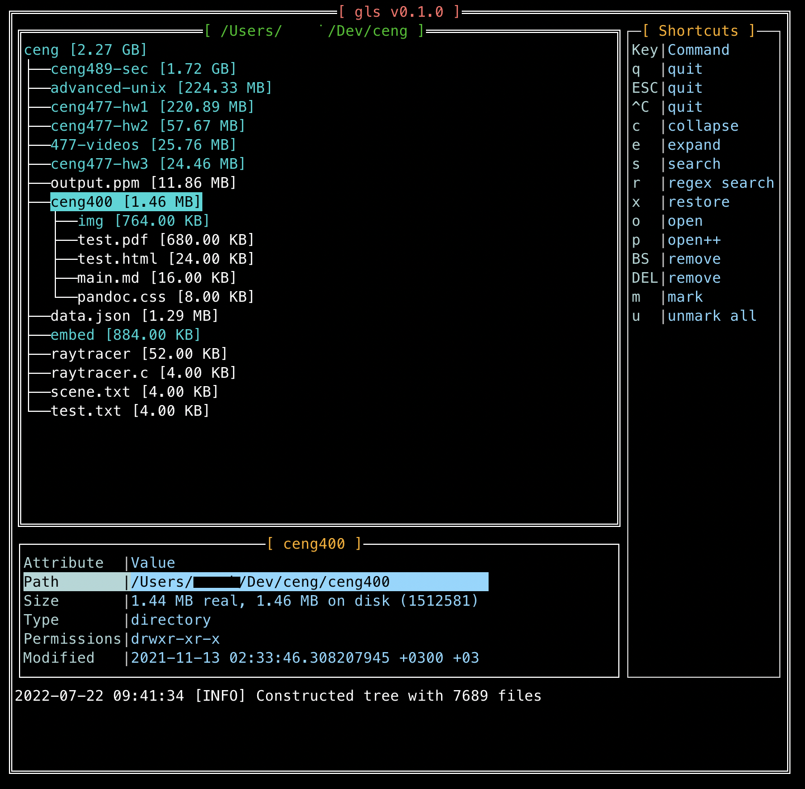

# gls

[](https://go.dev/)
[](https://github.com/ozansz/gls)
[](https://svgshare.com/i/Zhy.svg)
[](https://svgshare.com/i/ZjP.svg)
[](https://svgshare.com/i/nM0.svg)

It’s `ls` + `du` + `tree` with interactive TUI on your terminal! `gls` is created to easily view, filter and search your files, folders and directories with their size whenever you need to open up some storage space. It wouldn’t be wrong to say that `gls` is a minimal yet powerful file manager CLI tool.

## Table of Contents

* [Installation](#installation)
* [Usage](#usage)
	+ [Default usage (TUI)](#default-usage-tui)
	+ [Text mode](#text-mode)
* [Features](#features)
	+ [TUI shortcuts](#tui-shortcuts)
	+ [Configuration](#configuration)
	+ [Command line arguments](#command-line-arguments)
* [How to Contribute](#how-to-contribute)

##  Installation

### From Go package

Simply run:

```bash
go install go.sazak.io/gls/cmd/gls@latest
```

### From Source Code

Installing `gls` on your machine with the source code is pretty simple: just clone the repo and install `cmd/gls/main.go`:

```bash
$ git clone https://github.com/ozansz/gls
$ cd gls
$ go install ./cmd/gls/main.go
```

After you run `go install` command, an executable file name `gls` is created in `$GOPATH/bin`. Now, you can simply run `gls` in terminal:

```bash
$ gls
```

### For Ubuntu/Debian and derivatives

If you use a Debian-based distro on Linux, you can download the package which seems like `gls_<VERSION_NUMBER>_amd64.deb` from [Releases](https://github.com/ozansz/gls/releases) page. Then, you can install it
* via a package management software with GUI by clicking on the package if you use desktop environment
* or from the terminal, type `sudo dpkg -i gls_<VERSION_NUMBER>_amd64.deb` in the directory where you downloaded the package. 

### For Windows

You can apply the similar procedure in PowerShell shown in the [From Source Code](#from-source-code) section:

```powershell
> git clone https://github.com/ozansz/gls
> cd .\gls\
> go install -v .\cmd\gls\main.go
```
Now, you can use `gls` in all directories.

## Usage
There are two running modes of `gls`: TUI and text-based.

The TUI mode is interactive and you will be able to use all of the [features](#features) of `gls`, such as searching by text/regular expression, traversing on the file tree, creating/opening/deleting files and many other things,  until you close the program.

The text mode however, is fairly simple and is a literal combination of running `tree` and `du` altogether, with some additional features.

### Default usage (TUI)
The command below runs `gls` with TUI, which is the default mode. It parses the file tree under the specified path along with the file and folder sizes on disk, then shows the tree view of the parsed tree.

```bash
gls -path ~/Downloads
```



### Text mode
The command below does the same parsing process as the command above does. Except, this one just dumps the parsed tree as a the `tree` command does with the file/folder sizes and permissions, to the terminal.

```bash
gls -nogui -path ~/Documents
```

## Features
`gls` includes (and still continues to include more) several features that mimic a normal file manager:
* List the files and folders under the specified path, in tree view
* Show current file info: size on disk, permissions, path, MIME type and last modification
* Sort the tree by the size on disk
* Search files/folders by name, using both plaintext and regular expressions
* Ignore specific files/folders by using regular expressions, similar to `.gitignore` style
	* Default ignore file is `.glsignore`, but infinitely many other ignore files can be specified through the CLI [arguments](#command-line-arguments)
* Open files and folders by default programs or executables that you specify
* Copy/paste and move files and folders
* Remove files
* Create (similar to `touch`) and open files to edit
* Walk on the file tree, collapse and expand nodes easily

### TUI shortcuts

| Shortcut           | Command            | Description                                                                                                                                                                    |
| ------------------ |--------------------|--------------------------------------------------------------------------------------------------------------------------------------------------------------------------------|
| `q`, `ESC`, `ˆC`        | quit               | Exits the program                                                                                                                                                              |
| `c`                  | collapse           | Collapses all nodes in the file tree view                                                                                                                                      |
| `e`                  | expand             | Expands all nodes in the file tree view                                                                                                                                        |
| `s`                  | search             | Opens modal to search nodes (files and folders) by name                                                                                                                        |
| `r`                  | regex search       | Same as search, but you can search using regular expressions                                                                                                                   |
| `x`                  | restore            | Loads the original file tree view, mostly used after `search` and `regex search`                                                                                               |
| `o`                  | open               | Opens the selected (on hover) file/folder with the default program                                                                                                             |
| `p`                  | open               | Opens modal to specify the executable path which will be used to open the selected (on hover) file/folder                                                                      |
| `BACKSPACE` , `DEL`    | remove             | Removes the selected (on hover) file. Folder removal is currently not supported                                                                                                |
| `m`                  | mark               | Marks/unmarks the selected (on hover) file or folder. Marked nodes can be used later for `duplicate` and `move`                                                                |
| `u`                  | unmark             | Unmarks all the marked files and folders                                                                                                                                       |
| `n`                  | new                | Create a new file                                                                                                                                                              |
| `d`                  | duplicate          | Copy/pastes the marked files and folders to a specified destination. The destination is specified by the text input of the opened form. |
| `v`                  | open file in vim   | Opens file in VIM editor.                                                                                                                                                      |
| `TAB`, `SPACE`, `ENTER`  | toggle expand node | Expands the node if currently collapsed, and vice versa, the selected (on hover) file or folder                                                                                |
| `ARROW KEYS`, `SCROLL` | navigate           | Navigates between nodes in the file tree view                                                                                                                                  |

### Configuration

You can freely change the key bindings and shortcuts or configure the program for your needs from `gui/core.go` .

After your changes, run

```bash
go build cmd/gls/main.go
```
in the project directory.

In addition, if you think that your configurations or other changes seem necessary to improve the project, your contributions will be welcomed :)

### Customize color palette

You can customize the color palette with `.glsrc` file.  The only thing you need to do is create a `.glsrc` file in `$HOME`
directory and set the colors as key-value pairs. An example is below:

```text
GridTitleColor=blue
TreeViewTitleColor=yellow
FileInfoTitleColor=lightgreen
DirectoryColor=red
BorderColor=white
FileInfoAttrColor=orange
FileInfoValueColor=pink
SearchFormTitleColor=brown
UnmarkedFileColor=deeppink
MarkedFileColor=gray
FileInfoTabAttrWidth=30
```

When you run the program, the color palette values are overridden with values in `.glsrc` file. The file must be stored in 
`$HOME` directory and the file name must be `.glsrc`. Otherwise, the program uses the default color palette values.  

### Command line arguments

```bash
-debug
    	Increase log verbosity
-fmt string
   		size formatter, one of bytes, pow10 or none (default "bytes")
-ignore string
    	Comma-separated ignore files that specify which files folders to exclude
-nogui
    	text-only mode
-path string
    	path to run on (required)
-sort
    	sort nodes by size (default true)
-thresh string
    	size filter threshold, e.g. 10M, 100K, etc.
```
> You can also read this section from terminal by using `gls` without parameters.

## How to Contribute

You are very welcome to contribute to `gls`! Here are a few steps to guide you how to start contributing:

1. Check [the open issues tab](https://github.com/ozansz/gls/issues) to see if there are any issue you may be interested in fixing. You can also list the [issues with only the good-first-issue tag](https://github.com/ozansz/gls/issues?q=is%3Aissue+is%3Aopen+label%3A%22good+first+issue%22)

2. Check the [contributing guide](CONTRIBUTING.md) for more explanation on setting up the development environment, opening the PR, etc.